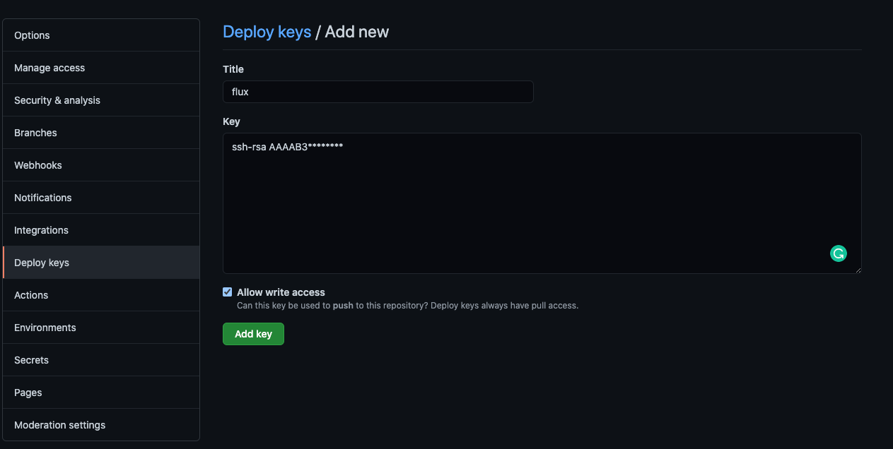

## Prerequisite
- crate kuberentes
- crate git [flux-demo](https://github.com/wardviaene/flux-demo) to associate with flux
```
flux-demo/namespaces/demo.yaml : namespace create
flux-demo/workloads/hello-service.yaml : servic create
flux-demo/workloads/hello.yaml : deployment create
```

deployment (flux-demo/workloads/hello.yaml)
```
---
apiVersion: apps/v1
kind: Deployment
metadata:
  name: docker-nodejs-demo
  namespace: demo
  labels:
    app: docker-nodejs-demo
  annotations:
    fluxcd.io/automated: "true"
    fluxcd.io/tag.docker-nodejs-demo: semver:~1.0.0
spec:
  strategy:
    rollingUpdate:
      maxUnavailable: 0
    type: RollingUpdate
  selector:
    matchLabels:
      app: docker-nodejs-demo
  template:
    metadata:
      labels:
        app: docker-nodejs-demo
    spec:
      containers:
      - name: docker-nodejs-demo
        image: wardviaene/docker-nodejs-demo:1.0.2
        ports:
        - name: nodejs-port
          containerPort: 3000

```

service 
```
apiVersion: v1
kind: Service
metadata:
  name: docker-nodejs-demo
  namespace: demo
spec:
  ports:
  - port: 80
    targetPort: nodejs-port
    protocol: TCP
  select3or:
    app: docker-nodejs-demo
  type: NodePort
```

namespace
```
apiVersion: v1
kind: Namespace
metadata:
  labels:
    name: demo
  name: demo
```

## Install Flux

* Install flux on osx
```
brew install fluxctl
```

* setup gitconfig
```
export GHUSER="sysmoon"
```

* run flux
```
# create NS
k create ns flux

# run flux
fluxctl install \
--git-user=${GHUSER} \
--git-email=${GHUSER}@gmail.com \
--git-url=git@github.com:${GHUSER}/flux-demo \
--git-path=namespaces,workloads \
--namespace=flux | kubectl apply -f -
```

* check deployment
```
> kubectl -n flux rollout status deployment/flux
deployment "flux" successfully rolled 

> kubectl get pod -n flux
NAME                        READY   STATUS    RESTARTS   AGE
flux-76cdc679c6-n2wqk       1/1     Running   0          3m52s
memcached-d679c8f86-rzh45   1/1     Running   0          3m52s

```

* register flux key(public key) to git repository to access more secure.
copy public key to github configuration (flux-dmeo -> Settings -> Deploy Keys)
and then enable checkbox "allow write access" flux can commmit to git 
```
fluxctl identity --k8s-fwd-ns flux

ssh-rsa AAAA******
```




## Check Deployment

* check flux pod working well
```
> k get pod -n flux
NAME                        READY   STATUS    RESTARTS   AGE
flux-55558c478d-6zrmz       1/1     Running   0          3m1s
memcached-d679c8f86-jsmzr   1/1     Running   0          3m1s

> k logs pod/flux-55558c478d-6zrmz -n flux  

ts=2021-07-25T04:17:08.594462987Z caller=loop.go:134 component=sync-loop event=refreshed url=ssh://git@github.com/sysmoon/flux-demo branch=master HEAD=e29eb4d18200d51a0576f585814417cf97607ec0

ts=2021-07-25T04:17:08.742863869Z caller=sync.go:64 component=daemon info="trying to sync git changes to the cluster" old=e29eb4d18200d51a0576f585814417cf97607ec0 new=e29eb4d18200d51a0576f585814417cf97607ec0

ts=2021-07-25T04:17:09.986560899Z caller=sync.go:540 method=Sync cmd=apply args= count=3

ts=2021-07-25T04:17:11.459551246Z caller=sync.go:606 method=Sync cmd="kubectl apply -f -" took=1.472933047s err=null output="namespace/demo created\nservice/docker-nodejs-demo created\ndeployment.apps/docker-nodejs-demo created"

ts=2021-07-25T04:17:14.975903157Z caller=loop.go:236 component=sync-loop state="tag flux" old=e29eb4d18200d51a0576f585814417cf97607ec0 new=e29eb4d18200d51a0576f585814417cf97607ec0

ts=2021-07-25T04:17:17.29061918Z caller=loop.go:134 component=sync-loop event=refreshed url=ssh://git@github.com/sysmoon/flux-demo branch=master HEAD=e29eb4d18200d51a0576f585814417cf97607ec0
```

* connecto to demo page using port-forward
```
k port-forward svc/docker-nodejs-demo 8080:80 -n demo
```


